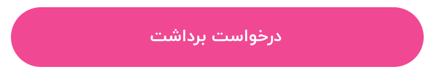

## Button

<br/>



### Example

```javascript
.
.
import UFRN from 'react-native-usefull'
.
.
{/* درخواست برداشت */}
    <UFRN.Button
        onPress={() => {
            if (this.props.profile.shaba) {
                if (validateIranianSheba(this.props.profile.shaba)) {
                    this.props.showWithdrawModal()
                } else {
                    RaiqToast.show(Strings.balanceScreen.yourShabaInvalidPleaseEdit, RaiqToast.durations.SHORT, RaiqToast.types.WARN)
                }
            } else {
                RaiqToast.show(Strings.balanceScreen.plsEnterYourShabaNumberSetting, RaiqToast.durations.SHORT, RaiqToast.types.WARN)
            }
        }}
        text={Strings.balanceScreen.withDrawalRequest}
        style={{
            marginTop: hp('1%'),
            width: '100%',
            backgroundColor: Color.BUTTON_SECOND,
        }}
        textStyle={{ fontFamily: FontFamily.BUTTON }}
    />
```
# Reference

## Props

#### **onPress**

Handler to be called when the user taps the button

TYPE         | REQUIRED
------------ | -----------
_function_   | _no_
___

#### **disabled**

If true, disable all interactions for this component.

TYPE         | REQUIRED    | DEFAULT
------------ | ----------- | ----------
_bool_    | _no_        | _false_
___

#### **loading**

If true, disable display progress inside button

TYPE         | REQUIRED    | DEFAULT
------------ | ----------- | ----------
_bool_    | _no_        | _false_
___

#### **text**

Text to display inside the button

TYPE         | REQUIRED    
------------ | ----------- 
_string_    | _no_        
___

#### **textStyle**

style for text button

TYPE         | REQUIRED    | DEFAULT
------------ | ----------- | ----------
_TextStyle_    | _no_        | _{ color: '#FFFFFF', fontSize: 20}_
___

#### **imageSource**

If display image/icon inside button use this prop

TYPE         | REQUIRED    | DEFAULT
------------ | ----------- | ----------
_string_ , _{uri: http://image.png}_    | _no_        | 
___

#### **imageStyle**

style for image/icon button

TYPE         | REQUIRED    | DEFAULT
------------ | ----------- | ----------
_ImageStyle_    | _no_        | 
___

#### **style**

style for  button

TYPE         | REQUIRED    | DEFAULT
------------ | ----------- | ----------
_ViewStyle_    | _no_        | 

## note
For press animation use ripple