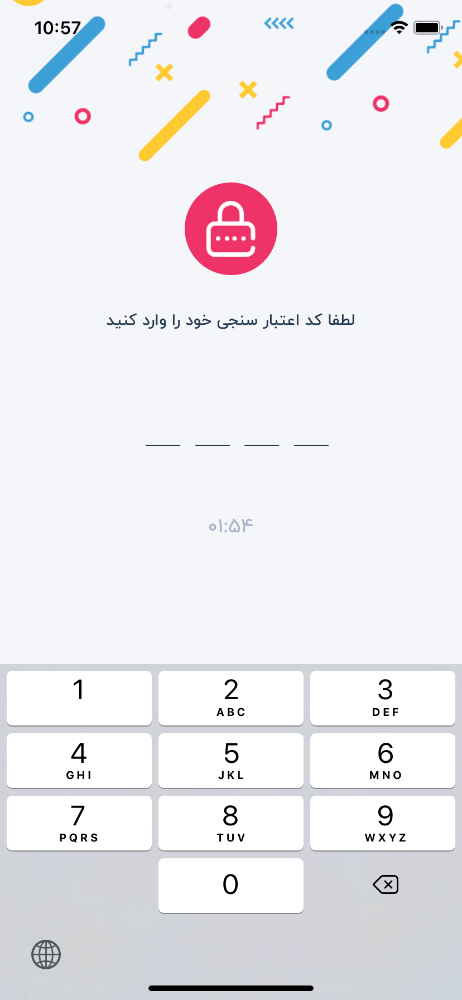

## TimerCountdown

<br/>



### Example

```javascript
.
.
import TimerCountdown from './TimerCountdown';
.
.
    // set timer count down for send again verification code
    <TimerCountdown
        initialMilliseconds={1000 * 60 * 2}
        onExpire={() => this.setState({ resendActive: true, status: 1 })}
        formatMilliseconds={(milliseconds) => {
            const remainingSec = Math.round(milliseconds / 1000);
            const seconds = parseInt((remainingSec % 60).toString(), 10);
            const minutes = parseInt(((remainingSec / 60) % 60).toString(), 10);
            const hours = parseInt((remainingSec / 3600).toString(), 10);
            const s = seconds < 10 ? '0' + seconds : seconds;
            const m = minutes < 10 ? '0' + minutes : minutes;
            let h = hours < 10 ? '0' + hours : hours;
            h = h === '00' ? '' : h + ':';
            return h + m + ':' + s;
        }}
        allowFontScaling={true}
    />
.
.
```
# Reference

## Props

#### **initialMilliseconds**

The remaining milliseconds for the countdown

TYPE         | REQUIRED    | DEFAULT
------------ | ----------- | ----------
_number_    | _yes_        | 
___

### **formatMilliseconds**

A function that formats the milliseconds

TYPE         | REQUIRED    | DEFAULT
------------ | ----------- | ----------
_function_    | _no_        | 
___

### **onTick**

A function to call each tick

TYPE         | REQUIRED    | DEFAULT
------------ | ----------- | ----------
_function_    | _no_        | 
___

### **onExpire**

A function to call when the countdown finishes

TYPE         | REQUIRED    | DEFAULT
------------ | ----------- | ----------
_function_    | _no_        | 
___

### **allowFontScaling**

A boolean for allowFontScaling. The default is false	

TYPE         | REQUIRED    | DEFAULT
------------ | ----------- | ----------
_boolean_    | _no_        | 
___

### **style**

Custom style to be applied to the Text component	

TYPE         | REQUIRED    | DEFAULT
------------ | ----------- | ----------
_object_    | _no_        | 

## note

to read more about this component click [here](https://github.com/ceaucari/react-native-timer-countdown)