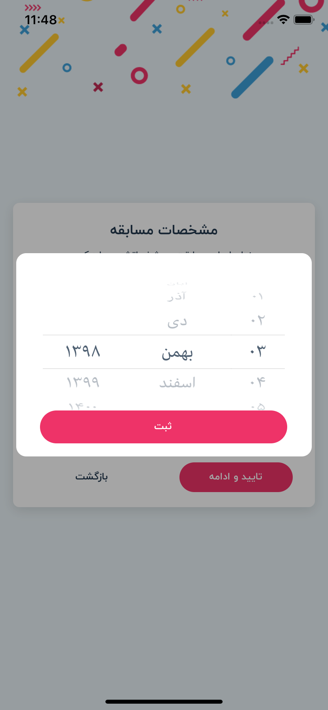

## Date picker

<br/>



### Example

```javascript
.
.
import UFRN from 'react-native-usefull'
.
.
    {/* Date picker modal */}
    <UFRN.DatePicker
        screenType={'MODAL'}
        separator={'/'}
        dateType={this.props.language.value === 'fa' ? 'JALALI' : 'GREGORIAN'}
        value={this.props.group.competitionDate}
        visible={this.props.dateModal}
        textStyle={{ color: Color.TEXT_TITLE }}
        buttonText={Strings.global.record}
        buttonTextStyle={{ fontSize: FontSize.BUTTON, fontFamily: FontFamily.BUTTON }}
        buttonStyle={{ width: '92%', height: wp('10%'), marginTop: hp('5%'), alignSelf: 'center', }}
        onSubmit={(value) => this.props.setCompetitionDate(value)}
        onClose={() => this.props.hideDateModal()} />
.
.
```
# Reference

## Props

#### **screenType**

screen size of date picker,
choose on of MODAL or FULLSCREEN

TYPE         | REQUIRED    | DEFAULT
------------ | ----------- | ----------
_string_    | _no_        | _MODAL_
___

#### **dateType**

type of date picker,
choose on of JALALI or GREGORIAN

TYPE         | REQUIRED    | DEFAULT
------------ | ----------- | ----------
_string_    | _yes_        | 
___

#### **separator**

choose separator text,
choose on of / or - or :

TYPE         | REQUIRED    | DEFAULT
------------ | ----------- | ----------
_string_    | _yes_        | 
___

#### **visible**

use true or false for visible or invisible date picker,
default is false

TYPE         | REQUIRED    | DEFAULT
------------ | ----------- | ----------
_bool_    | _yes_        | _false_
___

#### **disabled**

use true or false for disable or enable action button,
default is false

TYPE         | REQUIRED    | DEFAULT
------------ | ----------- | ----------
_bool_    | _no_        | _false_
___

#### **loading**

use true or false for disable or enable loading,
default is false

TYPE         | REQUIRED    | DEFAULT
------------ | ----------- | ----------
_bool_    | _no_        | _false_
___

#### **style**

style for view

TYPE         | REQUIRED    | DEFAULT
------------ | ----------- | ----------
_ViewStyle_    | _no_        | 
___

#### **textStyle**

style for text in picker

TYPE         | REQUIRED    | DEFAULT
------------ | ----------- | ----------
_TextStyle_    | _no_        | 
___

#### **buttonText**

text for button inside date picker

TYPE         | REQUIRED    | DEFAULT
------------ | ----------- | ----------
_string_    | _yes_        | 
___

#### **buttonTextStyle**

style for text button inside date picker

TYPE         | REQUIRED    | DEFAULT
------------ | ----------- | ----------
_TextStyle_    | _no_        | 
___

#### **buttonStyle**

style for button inside date picker

TYPE         | REQUIRED    | DEFAULT
------------ | ----------- | ----------
_ViewStyle_    | _no_        | 
___

#### **value**

default value for date picker

TYPE         | REQUIRED    | DEFAULT
------------ | ----------- | ----------
_object_    | _no_        | 
___

#### **data**

language data picker

TYPE         | REQUIRED    | DEFAULT
------------ | ----------- | ----------
_array_    | _yes_        | 
___

#### **onSubmit**

submit function date picker

TYPE         | REQUIRED    | DEFAULT
------------ | ----------- | ----------
_function_    | _no_        | 
___

#### **onClose**

close or hidden date picker

TYPE         | REQUIRED    | DEFAULT
------------ | ----------- | ----------
_function_    | _no_        |

## note
in this date picker use wheel picker
