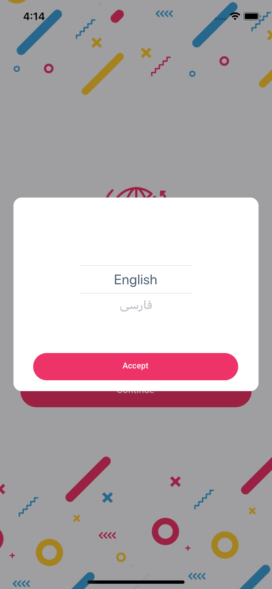

## Language picker

<br/>



### Example

```javascript
.
.
import UFRN from 'react-native-usefull'
.
.
    <UFRN.LanguagePicker
        style={{ backgroundColor: Color.BACKGRAND_BOX}}
        screenType={'MODAL'}
        value={this.props.language}
        data={this.state.languageCodeData}
        visible={this.props.chooseLanguageModal}
        textStyle={{ color: Color.TEXT_TITLE }}
        buttonText={Strings.global.accept}
        buttonTextStyle={{ fontSize: FontSize.BUTTON, fontFamily: FontFamily.BUTTON }}
        buttonStyle={{ width: '92%', height: wp('10%'), marginTop: hp('5%'), alignSelf: 'center', }}
        onSubmit={(language) => this.setLang(language)}
        onClose={() => this.props.hideChooseLanguageModal()} 
    />
.
.
```
# Reference

## Props

#### **screenType**

screen size of date picker,
choose on of MODAL or FULLSCREEN

TYPE         | REQUIRED    | DEFAULT
------------ | ----------- | ----------
_string_    | _no_        | _MODAL_
___

#### **visible**

use true or false for visible or invisible language picker,
default is false

TYPE         | REQUIRED    | DEFAULT
------------ | ----------- | ----------
_bool_    | _yes_        | _false_
___

#### **disabled**

use true or false for disable or enable action button,
default is false

TYPE         | REQUIRED    | DEFAULT
------------ | ----------- | ----------
_bool_    | _no_        | _false_
___

#### **loading**

use true or false for disable or enable loading,
default is false

TYPE         | REQUIRED    | DEFAULT
------------ | ----------- | ----------
_bool_    | _no_        | _false_
___

#### **style**

style for view

TYPE         | REQUIRED    | DEFAULT
------------ | ----------- | ----------
_ViewStyle_    | _no_        | 
___

#### **textStyle**

style for text in picker

TYPE         | REQUIRED    | DEFAULT
------------ | ----------- | ----------
_TextStyle_    | _no_        | 
___

#### **buttonText**

text for button inside language picker

TYPE         | REQUIRED    | DEFAULT
------------ | ----------- | ----------
_string_    | _yes_        | 
___

#### **buttonTextStyle**

style for text button inside language picker

TYPE         | REQUIRED    | DEFAULT
------------ | ----------- | ----------
_TextStyle_    | _no_        | 
___

#### **buttonStyle**

style for button inside language picker

TYPE         | REQUIRED    | DEFAULT
------------ | ----------- | ----------
_ViewStyle_    | _no_        | 
___

#### **value**

default value for language picker

TYPE         | REQUIRED    | DEFAULT
------------ | ----------- | ----------
_object_    | _no_        | 
___

#### **data**

language data picker

TYPE         | REQUIRED    | DEFAULT
------------ | ----------- | ----------
_array_    | _yes_        | 
___

#### **onSubmit**

submit function language picker

TYPE         | REQUIRED    | DEFAULT
------------ | ----------- | ----------
_function_    | _no_        | 
___

#### **onClose**

close or hidden language picker

TYPE         | REQUIRED    | DEFAULT
------------ | ----------- | ----------
_function_    | _no_        | 

## note
in this Language picker use wheel picker
