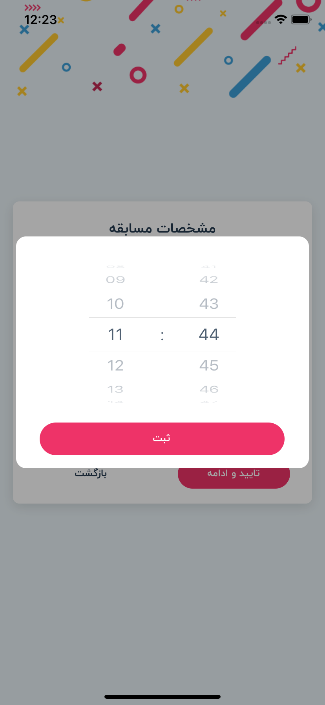

## Time picker

<br/>



### Example

```javascript
.
.
import UFRN from 'react-native-usefull'
.
.
    {/* Time picker modal */}
    <UFRN.TimePicker
        style={{ backgroundColor: Color.BACKGRAND_BOX }}
        screenType={'MODAL'}
        separator={':'}
        value={this.props.group.competitionTime}
        visible={this.props.timeModal}
        textStyle={{ color: Color.TEXT_TITLE }}
        buttonText={Strings.global.record}
        buttonTextStyle={{ fontSize: FontSize.BUTTON, fontFamily: FontFamily.BUTTON }}
        buttonStyle={{ width: '92%', height: wp('10%'), marginTop: hp('5%'), alignSelf: 'center', }}
        onSubmit={(value) => this.props.setCompetitionTime(value)}
        onClose={() => this.props.hideTimeModal()} />
.
.
```
# Reference

## Props

#### **screenType**

screen size of time picker,
choose on of MODAL or FULLSCREEN

TYPE         | REQUIRED    | DEFAULT
------------ | ----------- | ----------
_string_    | _no_        | _MODAL_
___

#### **separator**

choose separator text,
choose on of / or - or :

TYPE         | REQUIRED    | DEFAULT
------------ | ----------- | ----------
_string_    | _yes_        | 
___

#### **visible**

use true or false for visible or invisible time picker,
default is false

TYPE         | REQUIRED    | DEFAULT
------------ | ----------- | ----------
_bool_    | _yes_        | _false_
___

#### **disabled**

use true or false for disable or enable action button,
default is false

TYPE         | REQUIRED    | DEFAULT
------------ | ----------- | ----------
_bool_    | _no_        | _false_
___

#### **loading**

use true or false for disable or enable loading,
default is false

TYPE         | REQUIRED    | DEFAULT
------------ | ----------- | ----------
_bool_    | _no_        | _false_
___

#### **style**

style for view

TYPE         | REQUIRED    | DEFAULT
------------ | ----------- | ----------
_ViewStyle_    | _no_        | 
___

#### **textStyle**

style for text in picker

TYPE         | REQUIRED    | DEFAULT
------------ | ----------- | ----------
_TextStyle_    | _no_        | 
___

#### **buttonText**

text for button inside time picker

TYPE         | REQUIRED    | DEFAULT
------------ | ----------- | ----------
_string_    | _yes_        | 
___

#### **buttonTextStyle**

style for text button inside time picker

TYPE         | REQUIRED    | DEFAULT
------------ | ----------- | ----------
_TextStyle_    | _no_        | 
___

#### **buttonStyle**

style for button inside time picker

TYPE         | REQUIRED    | DEFAULT
------------ | ----------- | ----------
_ViewStyle_    | _no_        | 
___

#### **value**

default value for time picker

TYPE         | REQUIRED    | DEFAULT
------------ | ----------- | ----------
_object_    | _no_        | 
___

#### **data**

time data picker

TYPE         | REQUIRED    | DEFAULT
------------ | ----------- | ----------
_array_    | _yes_        | 
___

#### **onSubmit**

submit function time picker

TYPE         | REQUIRED    | DEFAULT
------------ | ----------- | ----------
_function_    | _no_        | 
___

#### **onClose**

close or hidden time picker

TYPE         | REQUIRED    | DEFAULT
------------ | ----------- | ----------
_function_    | _no_        |

## note
in this time picker use wheel picker
